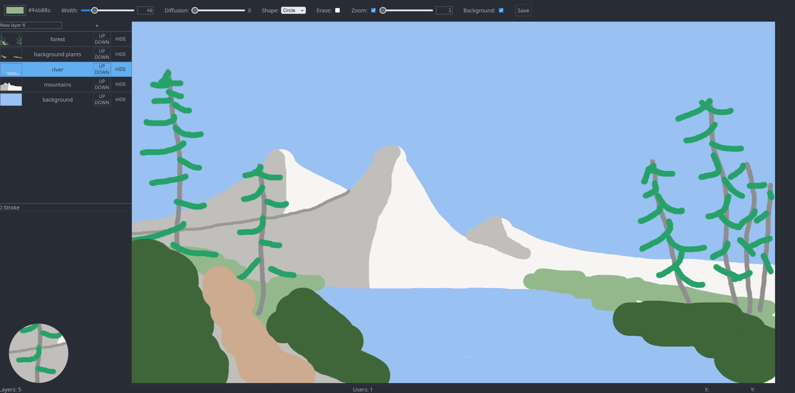

# fax

fax is a combination of tools that form a collaborative online drawing platform.

fax is composed of:

- DrInFo: a unique file format and data structure to store drawing information efficiently.
- tolower: a server that allows multiple clients to work on a shared DrInFo drawing.
- toupper: a frontend for tolower that allows people to draw in a familiar way.

## Features

### Current

fax has many features, including:

- real time collaboration
- participants live cursor
- layers
- per layer undo/redo
- multiple brushes
- saving and reopening a drawing
- eraser
- zoom

### Planned

fax also has some planned features:

- image insertion
- selection tool
- file optimization
- layer export

## Set up

1. Go to `tolower` and run `cargo run --release`
1. Go to `toupper` and run `pnpm i && pnpm run dev`
